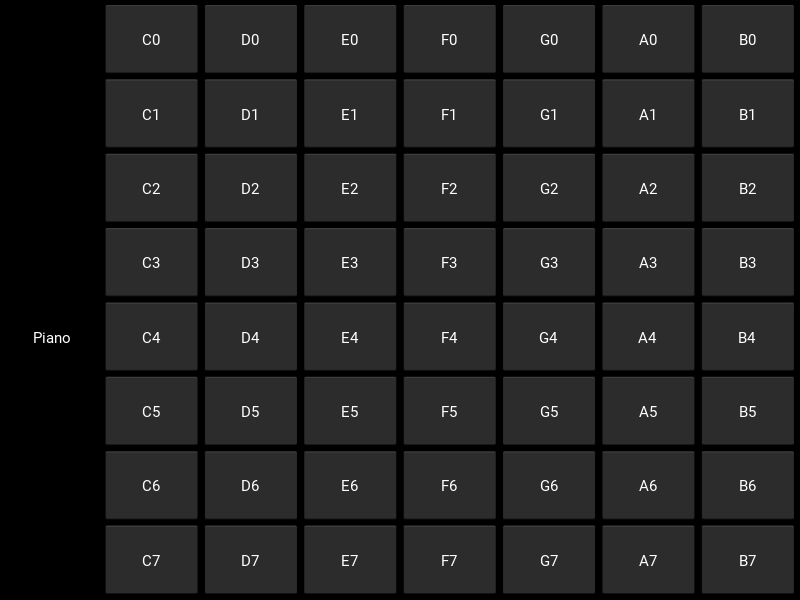

# PianoSons-Kivy

Piano com interface teclas de 0 a 7 criado no Python. Teclas por @plemaster01.

## Funcionalidades

    Toque suas músicas favoritas, com cliques ou no seu teclado.

## Pré-requisitos

### Certifique-se de ter o seguinte instalado antes de começar:
  
     Python 3
     Kivy

## Instalação e Uso

1. Baixe de acordo com sua plataforma:

    - Windows x64: 
    - Linux x86_64: 
    - Apk: Em breve.

2. Ou siga os seguintes passos:

- Clone o repositório:

        git clone https://github.com/Louiexz/PianoSons-Kivy.git
        cd PianoSons-Kivy
 
 - Instale as dependências:

        pip install -r requirements.txt

 - Execute o aplicativo:

        python PianoRun.py

## Estrutura do Projeto

    PianoSons-Kivy/
    │
    ├── PianoRun.py        # Arquivo principal do aplicativo
    ├── assets/            # Diretório contendo arquivos necessários
    |   ├── scripts/           # Diretório contendo pastas de funções e/ou classes
    │   |   ├── piano.py            # Inicialização, play e chamadas para keyboard
    │   |   ├── keyboard_functs.py  # Funções de entrada no teclado
    |   └── sound/             # Diretório contendo sons do piano
    |       └── notes/              # Sons referentes as notas
    └── requirements.txt   # Arquivo contendo as dependências do Python

## Contribuições
Louiexz - Autor e Desenvolvedor do piano 

Contribuições são bem-vindas! Sinta-se à vontade para abrir issues ou pull requests.